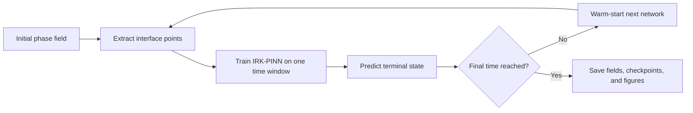

# MCL-PINNs

Official PyTorch implementation accompanying the manuscript:

> **A Phase-Field Neural Solver for Moving Contact Line Problems with Dynamic Boundary Conditions**  
> Ziyan Chen, Jinpeng Zhang, Pai Zhang, and Li Luo

MCL-PINNs is a physics-informed neural solver for phase-field models of moving contact lines. It solves the Cahn-Hilliard equation with dynamic boundary conditions using a discrete-time implicit Runge-Kutta (IRK) formulation. The framework is designed to resolve sharp diffuse interfaces, long-time evolution, localized contact-line motion, and strongly coupled boundary dynamics.

The current public release contains only the **hydrophilic droplet-coalescence experiment with a static contact angle of $50^\circ$** and its finite-element reference data. The other numerical examples and contact-angle configurations discussed in the manuscript are not included in this release.

## Method overview

MCL-PINNs combines:

- a multi-network time-marching strategy for long-time simulation;
- discrete-time PINNs based on high-order IRK schemes;
- variable scaling for stiff, sharply varying phase fields;
- a relaxed distribution constraint on the network output;
- interface-aware adaptive collocation sampling;
- adaptive weighting of PDE and boundary-condition losses;
- symmetry-preserving inputs for symmetric configurations; and
- alternating SOAP and Adam optimization.



The governing bulk equations are

$$
\frac{\partial \phi}{\partial t}=M\Delta\mu,
\qquad
\mu=-\varepsilon^2\Delta\phi+\phi^3-\phi,
$$

supplemented by a relaxation-type dynamic boundary condition for $\phi$ and a no-flux boundary condition for $\mu$.

## Repository contents

```text
MCL-PINNs/
├── Droplet coalescence.py
├── soap.py
├── IRK_weights.zip
└── FEM_reference_data_droplet_coalescence/
    └── theta_s=50_T=8.mat
```

- `Droplet coalescence.py` implements the MCL-PINNs solver and the droplet-coalescence experiment.
- `soap.py` contains the SOAP optimizer used to update the neural-network parameters.
- `IRK_weights.zip` contains Butcher tableaux for the supported IRK stage counts.
- `FEM_reference_data_droplet_coalescence/` contains the reference solution at $T=8$ for a static contact angle of $50^\circ$.

## Installation

Clone the repository and create an isolated Python environment:

```bash
git clone https://github.com/pdc31czy/MCL-PINNs.git
cd MCL-PINNs

python -m venv .venv
```

Activate the environment on Linux/macOS:

```bash
source .venv/bin/activate
```

or on Windows PowerShell:

```powershell
.\.venv\Scripts\Activate.ps1
```

Install PyTorch using the command appropriate for your CUDA version from the [official PyTorch installation guide](https://pytorch.org/get-started/locally/), then install the remaining dependencies:

```bash
python -m pip install numpy scipy matplotlib pyDOE
```

The experiments reported in the manuscript used **PyTorch 2.0.0** and a single **NVIDIA GeForce RTX 4090 GPU**. A CUDA-capable GPU is strongly recommended because the full time-marching experiments are computationally intensive.

## Required IRK-path configuration

Extract the supplied IRK coefficients:

```bash
python -m zipfile -e IRK_weights.zip .
```

The current experiment script contains a machine-specific absolute path for the IRK files. Before running it, edit the `np.loadtxt(...)` call in `Model.__init__` and point it to the extracted coefficient file:

```python
tmp = np.float64(
    np.loadtxt(
        "/absolute/path/to/MCL-PINNs/IRK_weights/Butcher_IRK%d.txt" % q,
        ndmin=2,
    )
)
```

Use an absolute path here because the script creates a timestamped results directory and changes into it before training starts.

## Running the droplet-coalescence experiment

The physical domain is $[-1,1]\times[-1,0]$. Two droplets of radius $0.4$, initially centered at $(\pm0.28,-1)$, evolve under the Cahn-Hilliard dynamics with $M=1$, $\varepsilon=0.02$, and boundary relaxation parameter $\alpha=100$.

### Public case: $\theta_s=50^\circ$

```bash
python "Droplet coalescence.py" \
  --t_final 8 \
  --theta_s 0.8726646259971648 \
  --q 20 \
  --adam_iter 10000
```

`theta_s` is specified in **radians**. The command above reproduces the principal settings of the publicly released $50^\circ$ case. Although `theta_s` is exposed as a command-line argument, configurations other than $50^\circ$ are not part of the current public release. To inspect every available option, run:

```bash
python "Droplet coalescence.py" --help
```

For a short smoke test of the execution pipeline, reduce both the final time and iteration count, for example:

```bash
python "Droplet coalescence.py" --t_final 0.1 --adam_iter 10 --q 20
```

This smoke test checks execution only; it is not expected to produce a converged physical solution.

## Main command-line options

| Option | Default | Description |
|---|---:|---|
| `--hid_layers` | `6` | Number of hidden layers |
| `--hid_neurons` | `128` | Neurons per hidden layer |
| `--M` | `1000` | Background LHS collocation points |
| `--num_x_col` | `50` | Candidate-grid resolution in $x$ for the initial interface |
| `--num_y_col` | `50` | Candidate-grid resolution in $y$ for the initial interface |
| `--adam_iter` | `10000` | Training iterations per adaptive-sampling round and time window |
| `--adam_lr` | `1e-3` | SOAP learning rate for network parameters |
| `--AW_lr` | `1e-3` | Adam learning rate for adaptive loss weights |
| `--q` | `20` | Number of IRK stages |
| `--Nx_scale` | `20` | Spatial scaling factor in $x$ |
| `--Ny_scale` | `20` | Spatial scaling factor in $y$ |
| `--epsilon` | `0.02` | Diffuse-interface thickness parameter |
| `--delta_t` | `0.1` | Time-marching window size |
| `--theta_s` | $50^\circ$ | Static contact angle, supplied in radians |
| `--alpha_var` | `100` | Contact-line relaxation parameter |
| `--debug_val` | `0` | Set to `1` to generate additional diagnostic plots |

## Outputs and restart behavior

Each run creates a directory named approximately

```text
42_9_22_YYYY-MM-DD_HH-MM/
```

It contains:

- `args_output.txt`: the parameters used for the run;
- `checkpoints/`: one PyTorch checkpoint per completed time window;
- `current_figures/`: phase-field plots for individual time windows;
- `current_figures_matlab_data/`: predicted fields in MATLAB `.mat` format;
- `loss_aw_data/`: loss and adaptive-weight histories; and
- `figures/`: final solution, loss, and adaptive-weight plots.

If the same output directory already contains checkpoints, the script attempts to resume from the latest one. Checkpoint restoration currently moves saved models to CUDA, so resuming requires a CUDA-enabled PyTorch installation.

## Reference results

For the publicly released MCL-PINNs configuration, the manuscript reports the following error at $t=8$ against the supplied FEM reference solution:

| Static contact angle | MSE | Relative $L_2$ error |
|---:|---:|---:|
| $50^\circ$ | $2.49\times10^{-4}$ | $1.63\times10^{-2}$ |

Small differences may occur across hardware and software environments despite the fixed random seed.

## Citation

This repository accompanies a manuscript currently under review. If you use this code, please cite the manuscript; the final bibliographic information will be added after publication.

```bibtex
@article{chen_mclpinns,
  title   = {A Phase-Field Neural Solver for Moving Contact Line Problems with Dynamic Boundary Conditions},
  author  = {Chen, Ziyan and Zhang, Jinpeng and Zhang, Pai and Luo, Li},
  note    = {Manuscript under review}
}
```

## Acknowledgments

This work was supported in part by National Natural Science Foundation of China 12371442, Macau FDCT 0035/2025/RIA1, Macau FDCT 0035/2026/RIA1, and University of Macau MYRG-GRG2025-00016-FST.
  
## License

No open-source license is currently included in this repository. Please contact the authors before redistributing or reusing the code beyond normal academic evaluation and citation.

## Contact

For questions about the method or implementation, please open a GitHub issue. Correspondence concerning the manuscript may be directed to Ziyan Chen at `yc37432@um.edu.mo`.
